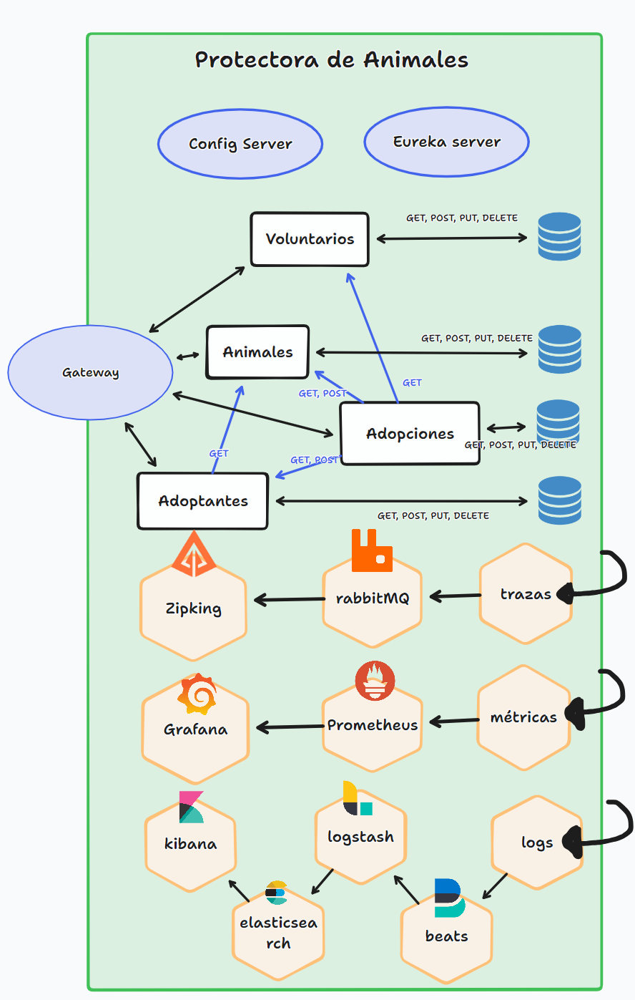
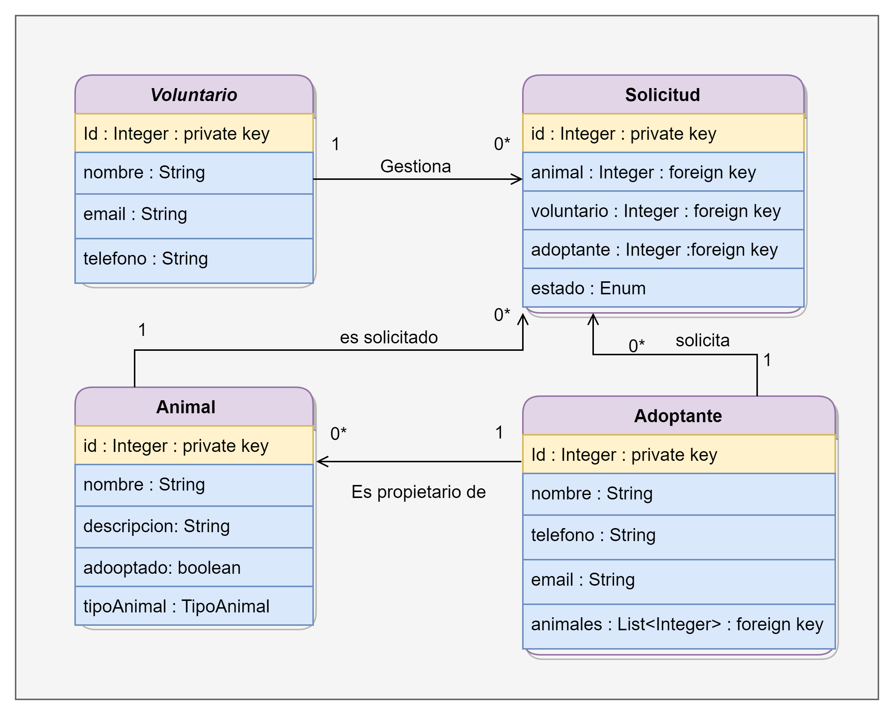

# Proyecto Protectora Animales
El proyecto tiene la siguiente estructura:

Las clases están relaccionadas entre sí así:

# Guía de uso
1``mvn clean install`` para instalar las dependencias del proyecto.
2``docker-compose up --build`` para levantar Rabbitmq , Zipkin y Postgres, elasticsearch, filebeat, grafana, jenkins, kibana, logstash y prometheus.
4. Arrancar desde el IDE el servicio Config Server.
5. Arrancar desde el IDE el servicio Eureka Server.
6. Arrancar desde el IDE el servicio Gateway Server.
7. Arrancar desde el IDE los servicios Voluntarios, Adoptantes, Animales y Adopciones.

# Documentación
- Config server: http://localhost:8888/<nombre_servicio>/default
- Eureka server: http://localhost:8761/
- Gateway: http://localhost:9000/
- Voluntarios: http://localhost:8080/swagger-ui.html
- Animales: http://localhost:8082/swagger-ui.html
- Adoptantes: http://localhost:8081/swagger-ui.html
- Adopciones:http://localhost:8083/swagger-ui.html
- Zipkin: http://localhost:9411/
- Prometheus: http://localhost:9090/graph
- Grafana dashboard: http://localhost:3000/d/spring_boot_21/transaccionesbancariashiberus
- Elasticsearch: http://localhost:9200/
- Kibana dashboard: http://localhost:5601/app/dashboards#/view/b24738d0-bc24-11ed-8284-cb55ba82334a
- Job de Jenkins: http://localhost:8086/job/ProtectoraAnimales/
- Resultados SonarQube: http://localhost:9001/dashboard?id=protectoraAnimales

# Autor
Miguel Díez García